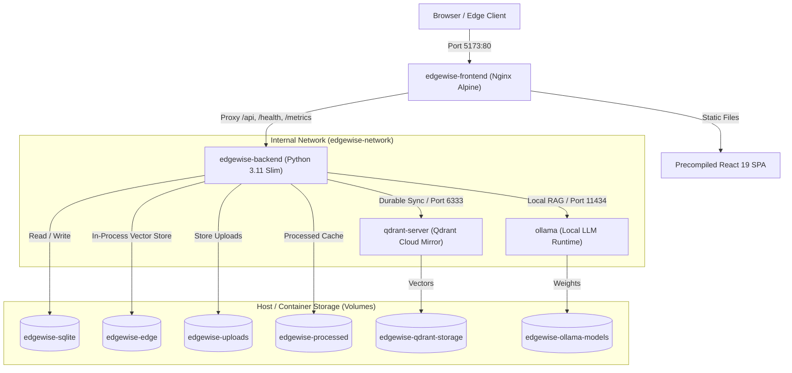

# Phase 12: Production Containerization, Docker Compose & CI/CD Deployment

## 1. Overview

Phase 12 transforms **EDGEWISE AI** from a local Python/Node development environment into an enterprise-ready, containerized, and reproducibly deployable platform.

The system encapsulates:
- **`edgewise-backend`**: FastAPI application server with embedded, in-process dual-shard **Qdrant Edge** vector memory engine and SQLite local database.
- **`edgewise-frontend`**: High-performance Nginx production web server serving pre-compiled React 19 single-page application assets and reverse-proxying API routes.
- **`qdrant-server`**: Cloud mirror and central vector synchronization target.
- **`ollama`**: Local Large Language Model runtime supporting offline conversational RAG and copilot inference.

---

## 2. Container Architecture



### Architectural Principles:
1. **In-Process Qdrant Edge**: Qdrant Edge runs directly within the backend Python process (`qdrant-edge-py`), preserving low-latency local vector indexing without network overhead. No fake standalone Qdrant Edge container is created.
2. **Minimal Attack Surface**: The production web server (Nginx) is the sole public perimeter point (`5173:80`), with backend exposed on `8000:8000`. Internal dependencies (`qdrant-server` on `6333` and `ollama` on `11434`) reside exclusively on the isolated internal Docker bridge network (`edgewise-network`).
3. **Non-Root Execution**: The backend container runs under non-privileged user `appuser` (UID: 10001).
4. **Deterministic Migrations**: Container startup invokes `docker-entrypoint.sh` which executes `alembic upgrade head` before handing execution to `uvicorn`.

---

## 3. Prerequisites

- **Docker Engine**: Version 24.0.0 or higher
- **Docker Compose**: Version v2.20.0 or higher (or Docker Desktop with WSL2 on Windows)
- **Memory**: Minimum 4 GB RAM (8 GB recommended when running Ollama LLM models locally)
- **Disk Space**: At least 10 GB free space for Docker images and local model weights

---

## 4. Quick Start: Clone → Configure → Run → Verify

### Step 1: Clone Repository
```bash
git clone https://github.com/your-org/edgewise-ai.git
cd edgewise-ai
```

### Step 2: Configure Environment
Copy the deployment configuration template to `.env`:
```bash
cp .env.example .env
```
*(Review `.env` to customize device identity or port mappings if necessary. Defaults are production-ready).*

### Step 3: Launch Services with Docker Compose
```bash
docker compose up -d --build
```

### Step 4: Verify Deployment Health
Check service health probes and end-to-end functionality using the automated verification tool:
```bash
python scripts/verify_deployment.py
```
Or query health directly via HTTP:
```bash
curl http://localhost:8000/health/ready
curl http://localhost:8000/health
```

### Step 5: Access the Web Application
Open your browser at:
```text
http://localhost:5173/
```

---

## 5. Development vs. Production Mode

| Dimension | Production (`docker-compose.yml`) | Development (`docker-compose.dev.yml`) |
|---|---|---|
| **Frontend Server** | Production Nginx Alpine serving precompiled static assets | Vite Development Server with HMR |
| **Backend Server** | Production Uvicorn with structured JSON logging | Uvicorn with `--reload` and debug logging |
| **Storage Mounts** | Named persistent Docker volumes | Host directory bind mounts (`./backend`, `./data/...`) |
| **Exposed Ports** | Frontend (`5173`), Backend (`8000`) | Frontend (`5173`), Backend (`8000`), Qdrant (`6333`, `6334`), Ollama (`11434`) |
| **Startup Command** | `docker compose up -d` | `docker compose -f docker-compose.dev.yml up` |

---

## 6. Service Healthchecks & Startup Sequencing

To eliminate race conditions and arbitrary `sleep` timeouts, compose defines strict health dependencies:

1. **`qdrant-server` Healthcheck**:
   ```yaml
   test: ["CMD-SHELL", "curl -f http://localhost:6333/healthz || exit 1"]
   interval: 15s
   timeout: 5s
   retries: 5
   ```
2. **`ollama` Healthcheck**:
   ```yaml
   test: ["CMD-SHELL", "ollama list || exit 1"]
   interval: 15s
   timeout: 5s
   retries: 5
   ```
3. **`edgewise-backend` Startup Dependency**:
   ```yaml
   depends_on:
     qdrant-server:
       condition: service_healthy
     ollama:
       condition: service_healthy
   healthcheck:
     test: ["CMD", "python", "-c", "import httpx; r = httpx.get('http://localhost:8000/health/live'); exit(0 if r.status_code == 200 else 1)"]
   ```
4. **`edgewise-frontend` Startup Dependency**:
   ```yaml
   depends_on:
     edgewise-backend:
       condition: service_healthy
   healthcheck:
     test: ["CMD-SHELL", "wget -q --spider http://127.0.0.1/ || exit 1"]
   ```

---

## 7. Database Migrations & Seed Data

### Automated Alembic Migrations
Every time `edgewise-backend` launches, its entrypoint executes:
```bash
alembic upgrade head
```
- On **fresh deployment**: Initializes revision tables (`001_initial_schema`, `002_phase6_sync_queue`, `003_phase8_conflict_resolution`).
- On **container restart**: Alembic checks current revision; existing tables and rows are left completely untouched.

### Optional Seed Data
To populate the database with realistic industrial maintenance fixtures without overwriting active data:
```bash
# Inside running container:
docker compose run --rm edgewise-backend python scripts/seed_db.py

# Or on host:
python scripts/seed_db.py
```

---

## 8. Persistence & Volume Management

EDGEWISE AI stores state exclusively in named Docker volumes to guarantee zero data loss across container lifecycle events (`down`, `rm`, `up`).

| Volume Name | Container Path | Purpose |
|---|---|---|
| `edgewise-sqlite` | `/app/data/sqlite` | SQLite relational database (`edgewise.db`) |
| `edgewise-edge` | `/app/data/qdrant_edge` | Local Qdrant Edge mutable & immutable shards |
| `edgewise-uploads` | `/app/data/uploads` | Original uploaded document binaries (PDF, Markdown) |
| `edgewise-processed` | `/app/data/processed` | Chunked and normalized text artifacts |
| `edgewise-qdrant-storage` | `/qdrant/storage` | Central Qdrant Server vector records & collections |
| `edgewise-ollama-models` | `/root/.ollama` | Downloaded Ollama LLM model parameters |

### Persistence Validation Procedure:
1. Upload a document via frontend or `scripts/verify_deployment.py`.
2. Stop and remove containers:
   ```bash
   docker compose down
   ```
3. Restart containers:
   ```bash
   docker compose up -d
   ```
4. Query documents (`curl http://localhost:8000/api/documents`): All documents, chunks, and embeddings remain 100% intact.

---

## 9. Backup & Disaster Recovery

### Creating Backups
To create an offline backup of all persistent data volumes into a compressed tar archive:
```bash
# 1. Gracefully stop containers
docker compose stop

# 2. Archive SQLite and vector store
docker run --rm \
  -v edgewise-sqlite:/sqlite \
  -v edgewise-edge:/edge \
  -v edgewise-uploads:/uploads \
  -v $(pwd)/backups:/backup \
  alpine tar czf /backup/edgewise_backup_$(date +%Y%m%d_%H%M%S).tar.gz -C / sqlite edge uploads

# 3. Resume containers
docker compose start
```

### Restoring from Backup
```bash
# 1. Stop containers
docker compose down

# 2. Restore volumes from archive
docker run --rm \
  -v edgewise-sqlite:/sqlite \
  -v edgewise-edge:/edge \
  -v edgewise-uploads:/uploads \
  -v $(pwd)/backups:/backup \
  alpine sh -c "tar xzf /backup/<BACKUP_FILE>.tar.gz -C /"

# 3. Start containers
docker compose up -d
```

---

## 10. Local / Offline Deployment Behavior

When internet access or cloud Qdrant is unavailable:
1. `qdrant-server` connection attempts log `TRANSIENT_NETWORK_ERROR`.
2. The durable synchronization queue buffers changes locally in SQLite (`sync_queue` table) with exponential backoff and jitter.
3. **Local document ingestion, chunking, embedding, vector storage in Qdrant Edge, and Ollama RAG continue to operate completely unhindered.**
4. When cloud connectivity is restored, the synchronization daemon automatically flushes pending items without manual intervention.

---

## 11. Continuous Integration & CD Pipeline

The CI workflow is configured in `.github/workflows/ci.yml`.

### Automated Pipeline Jobs:
1. **`security-audit`**:
   - Asserts `.env` is never tracked in Git.
   - Scans repository for unencrypted private keys and secret tokens.
2. **`backend-ci`**:
   - Ruff linting (`ruff check app/ tests/`).
   - Mypy type-checking.
   - Comprehensive Pytest unit tests (Phases 5, 6, 7, 8, 10).
3. **`frontend-ci`**:
   - Oxlint static analysis.
   - TypeScript compilation check (`tsc -b`).
   - Vitest component and flow tests.
   - Production Vite bundle build.
   - Bundle security scan (verifies no auth tokens or API keys compiled into static JS).
4. **`docker-validation`**:
   - Validates `docker compose config` against schema.
   - Builds both `edgewise-backend` and `edgewise-frontend` Docker images.
5. **`integration-resilience`**:
   - Launches Qdrant container dependency.
   - Executes Phase 11 resilience and fault-injection integration suite.
   - Executes automated cross-subsystem data integrity verifier.
