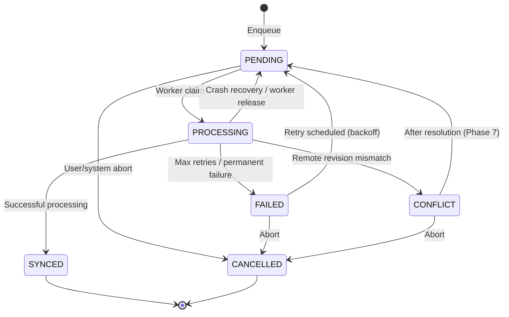

# EDGEWISE AI — Phase 6: Durable Synchronization Queue

## 1. Overview & Architectural Boundaries

Phase 6 implements a **durable, restart-safe, SQLite-backed synchronization queue** for EDGEWISE AI.

> **CRITICAL BOUNDARY:**
> Phase 6 implements the **durable local synchronization subsystem only**.
> It does **NOT** synchronize with remote Qdrant Server or cloud backends (reserved for Phase 7).
> It does **NOT** implement conflict resolution algorithms (reserved for Phase 7).
> It does **NOT** display or claim "Cloud synchronized" — data is "Queued locally" or "Awaiting synchronization".

---

## 2. Queue Architecture

The synchronization queue is built upon local SQLite as the single durable source of truth:
- **No in-memory only queues**: The queue survives application restarts, backend crashes, and container reboots.
- **Relational Integrity**:
  ```
  [User Action / Document Ingestion]
                │
                ▼
      [LocalWriteService]
                │
                ├──► Persist to [MemoryRecord] (SQLite)
                ├──► Upsert vector to [Qdrant Edge] (Local mutable shard)
                ├──► Enqueue logical [SyncItem] (SQLite durable queue)
                └──► Record immutable [AuditEvent] (SQLite)
  ```
- **Lifecycle Execution**:
  ```
  [SyncItem] (status: PENDING)
        │
        ▼ (Worker claims via batch)
  [SyncItem] (status: PROCESSING, processing_started_at recorded)
        │
        ├──► LocalNoopSyncBackend (Validates payload & local state)
        │
        ├──► SUCCESS: [SyncItem] -> SYNCED, [SyncAttempt] recorded (success)
        ├──► TRANSIENT FAILURE: Backoff delay computed -> next_retry_at set, returns to PENDING
        ├──► PERMANENT FAILURE / MAX RETRIES: [SyncItem] -> FAILED, next_retry_at cleared
        └──► CONFLICT: [SyncItem] -> CONFLICT (Awaiting Phase 7 resolution)
  ```

---

## 3. Persistent State Machine

### Allowed States

| State | Semantics |
|---|---|
| `PENDING` | Enqueued in SQLite, eligible to be claimed when `next_retry_at <= now()`. |
| `PROCESSING` | Currently claimed by an active worker; `processing_started_at` tracked. |
| `SYNCED` | Successfully processed (terminal). |
| `FAILED` | Reached max retry limit or failed with non-retryable error. |
| `CONFLICT` | Conflict detected between local and remote state versions. |
| `CANCELLED` | Manually or automatically aborted (terminal). |

### Valid Transitions Diagram



Arbitrary or invalid transitions (such as `PENDING → SYNCED` without `PROCESSING`, or moving away from terminal `SYNCED`) raise `InvalidStateTransitionError`.

---

## 4. Error Classification & Exponential Backoff Retry Policy

### Error Categories

| Error Category | Classification | Policy |
|---|---|---|
| `TRANSIENT_NETWORK_ERROR` | Retryable | Exponential backoff retry |
| `REMOTE_UNAVAILABLE` | Retryable | Exponential backoff retry |
| `TIMEOUT` | Retryable | Exponential backoff retry |
| `RATE_LIMITED` | Retryable | Exponential backoff retry |
| `VALIDATION_ERROR` | Non-retryable | Fails immediately (no retry) |
| `AUTHENTICATION_ERROR` | Non-retryable | Fails immediately (no retry) |
| `PERMANENT_FAILURE` | Non-retryable | Fails immediately (no retry) |
| `CONFLICT` | Conflict | Enters `CONFLICT` state |

### Backoff Calculation

Exponential backoff is dynamically computed using persisted configuration:
$$\text{delay} = \min\left(\text{sync\_max\_backoff\_seconds},\; \text{sync\_base\_backoff\_seconds} \times 2^{\text{retry\_count}-1}\right)$$

Default configuration:
- `sync_batch_size = 20`
- `sync_max_retries = 5`
- `sync_base_backoff_seconds = 2.0`
- `sync_max_backoff_seconds = 300.0`
- `sync_processing_timeout_seconds = 300.0`

`next_retry_at` is persisted to SQLite. Unclaimed items with future `next_retry_at` timestamps are ignored by workers until their backoff delay expires.

---

## 5. Crash Recovery & Abandoned Job Detection

If a worker process dies, terminates, or restarts while items are in `PROCESSING` state:

1. **Automatic Lifespan Hook**: On backend startup, `SyncQueueService.recover_abandoned()` is executed.
2. **Deterministic Timeout**: Finds any items where:
   $$\text{status} = \text{'processing'} \quad \text{AND} \quad \text{processing\_started\_at} \le (\text{now} - \text{timeout})$$
3. **Recovery Action**:
   - If retries remain: transitions item back to `PENDING`, increments retry count, applies backoff, and records a timeout `SyncAttempt`.
   - If max retries exceeded: marks item `FAILED`.
   - Emits structured audit warning.

---

## 6. Idempotency & Deduplication

- **Entity Idempotency**: When `enqueue` is called for an entity `(record_type, record_id)` that is already `PENDING`:
  - It supersedes the pending item with the newest payload, revision, and operation.
  - The stable `id` and `created_at` are preserved.
  - Prevents uncontrolled duplicate pending rows in the database.
- **Repeat Safe**: Running sync execution against the same entity produces deterministic, safe outcomes without creating duplicate logical state.

---

## 7. Tombstones & Delete Semantics

- When a local record is deleted, it is soft-deleted in `MemoryRecord` (`deleted_at` timestamp).
- Local vectors are purged from mutable Qdrant Edge shards.
- A durable `SyncItem` with `operation="delete"` is enqueued with an incremented revision and tombstone metadata.
- Guarantees delete actions are preserved across restarts and ready for Phase 7 cloud propagation.

---

## 8. Telemetry & Observability Endpoints

| Endpoint | Method | Description |
|---|---|---|
| `/api/sync/status` | `GET` | Real queue metrics (`queue_size`, `pending_count`, `processing_count`, `synced_count`, `failed_count`, `retrying_count`, `average_attempt_duration_ms`). |
| `/api/sync/queue` | `GET` | Paginated queue items with status filter. |
| `/api/sync/history` | `GET` | Paginated `sync_attempts` history with durations and categorized errors. |
| `/api/sync/run` | `POST` | Executes local queue batch via `LocalNoopSyncBackend`. |

---

## 9. Phase 7 Integration Boundary

- **Phase 6 Interface**: `SyncBackend` abstraction (`upsert`, `delete`, `health_check`).
- **Phase 7 Implementation**: A new `QdrantServerSyncBackend` will implement `SyncBackend` to push vectors and payloads to Qdrant Cloud / Remote Server with TLS, snapshot recovery, and distributed revision checks.
